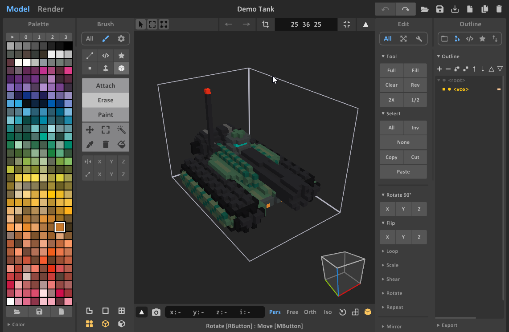
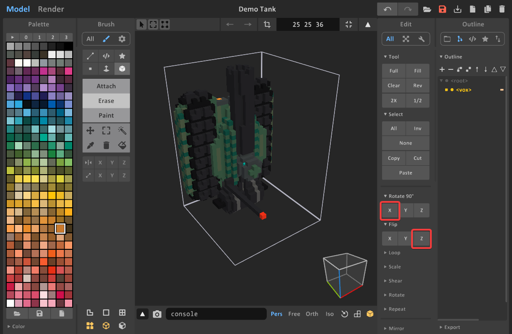
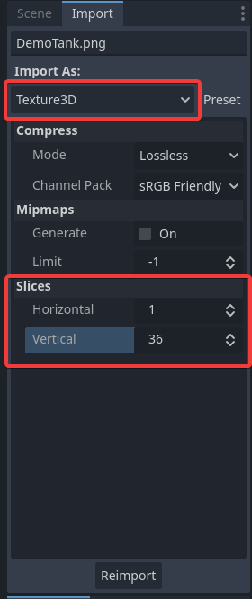
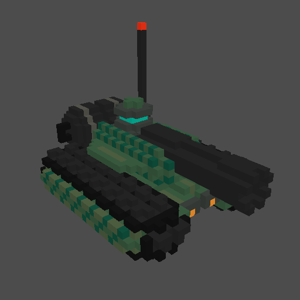

# Godot Voxel Raymarching Renderer
 A voxel raymarching renderer for Godot 4.x

This is a simple-ish voxel rendering system for rendering voxel models using a raymarching algorithm.

Currently only works with slice exports from MagicaVoxel, but theoretically could work with any voxel model that has been exported into slices a certain way.

## Usage
1. Prepare your voxel model for export. Make sure your model's front is pointing to +Z and the top is pointing to -Y
> [!TIP]
> Usually doing Rotate 90 on X and Flip on Z will do the trick.

This should be the end result:

2. Export the model as slices PNG image. **Make note of the Z dimension of your model! (in this example its 36)**
3. In your project with the addon added, import the slices as a Texture3D and make sure the horizontal slices are set to 1 and the vertical slices to the Z height of your exported voxel model.

4. Create a MeshInstance3D and attach the `voxel_model` script to it (you could also just instance a `VoxelModel` from the insert node menu)
5. Assign the slice texture image and the model should be setup automatically.

> [!TIP]
> Sometimes things might be weird or not work and reloading the project usually fixes it. I'll come up with a better way of handling things later

End result

## Tweaking the lighting
The shader uses the `diffuse_toon` and `specular_toon` by default but depending on the style desired, setting the `render_mode` to `unshaded` might look the best.

## License of code and assets

The example models here I made myself and are CC0, do whatever with them but the code for this project is under the MIT license. 
